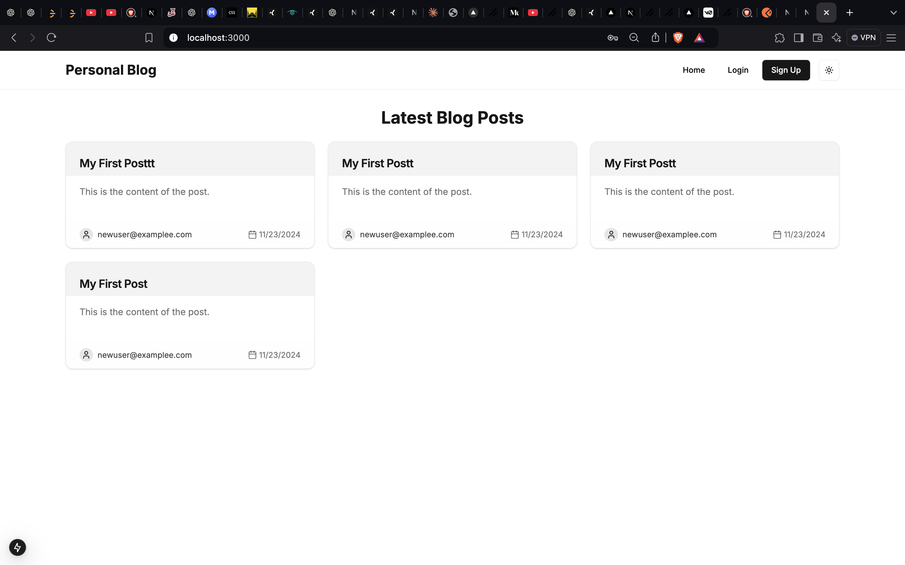
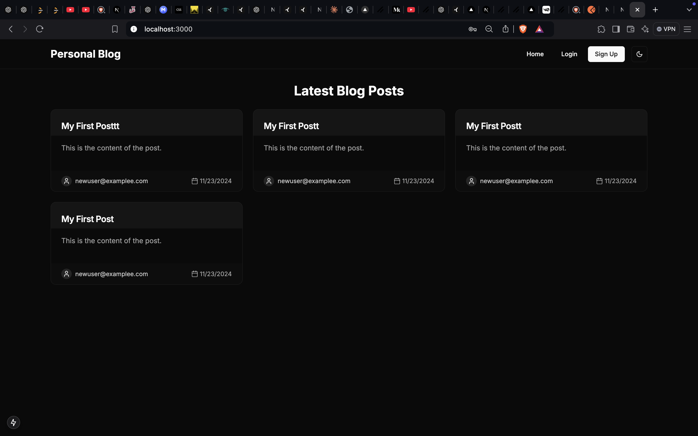
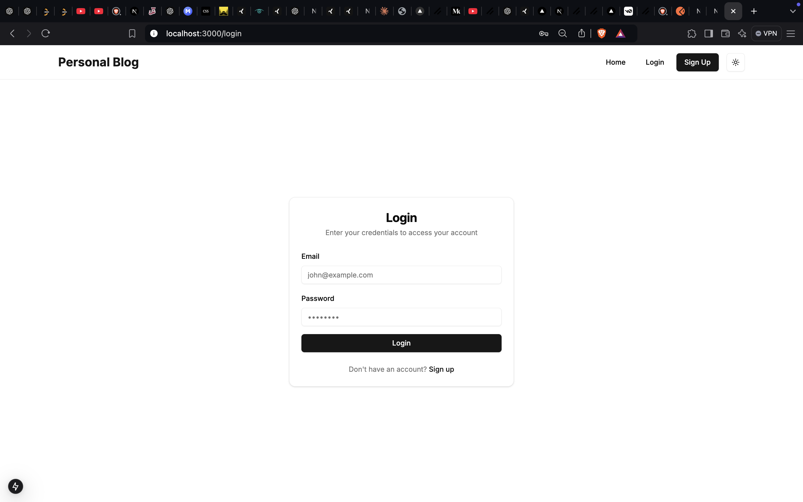
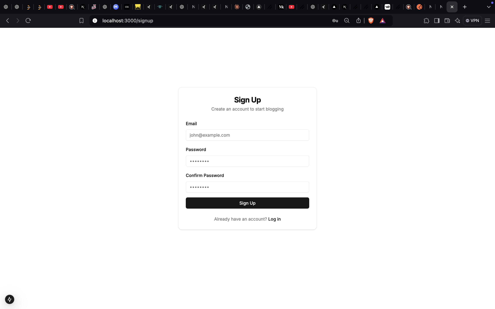
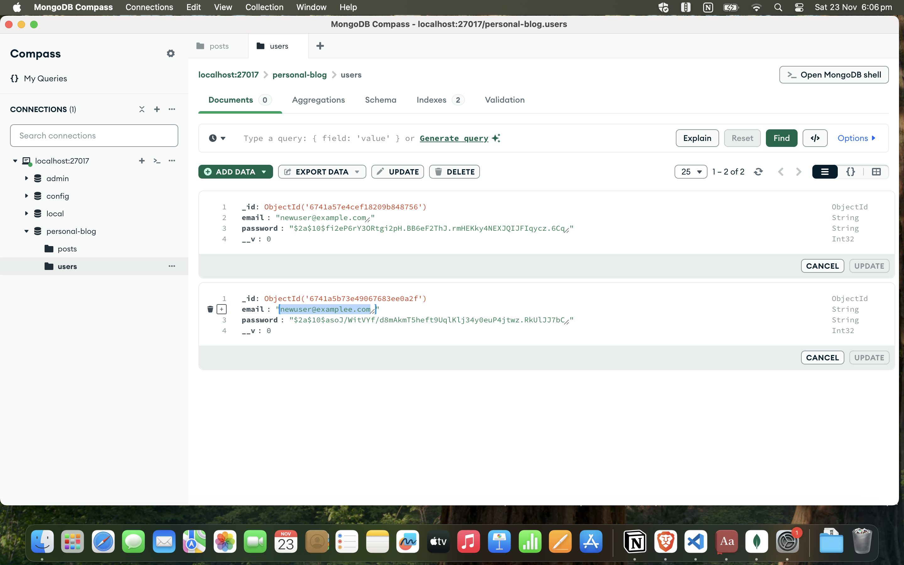
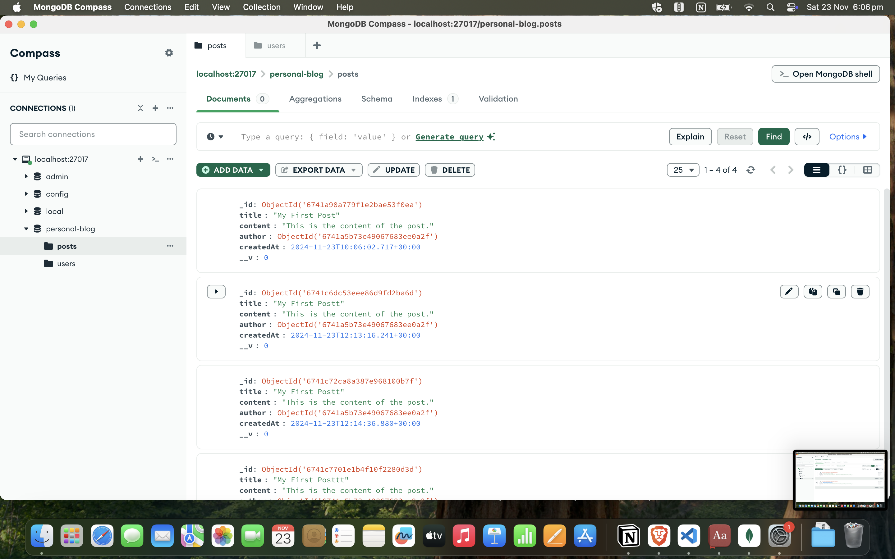

# 🚀 Full-Stack Personal Blog Platform

## **Built With Modern Tech Stack**
### TypeScript + Next.js + Shadcn/UI + Express.js + MongoDB

# Deployed Link
link: https://assin-attack-capital-b7no2hhba-rohitrky2021s-projects.vercel.app/

---

## 🌟 Overview

A powerful and modern full-stack personal blog platform that combines the best of contemporary web technologies to deliver a seamless blogging experience.

## 🏗️ Architecture

The project follows a clean, modular architecture split into two main components:

### 🎯 Backend (Express.js + MongoDB)
- RESTful API architecture
- MongoDB for robust data persistence
- JWT-based authentication
- Secure middleware implementation

### 🎨 Frontend (Next.js + TypeScript + Shadcn/UI)
- Modern React patterns with Next.js
- Type-safe development with TypeScript
- Beautiful UI components from Shadcn/UI
- Responsive design principles

## 📁 Project Structure

```
MY-NEXT-APP/
├── public/
├── src/
│   ├── app/
│   │   ├── dashboard/
│   │   ├── fonts/
│   │   ├── login/
│   │   ├── signup/
│   │   ├── favicon.ico
│   │   ├── globals.css
│   │   ├── layout.tsx
│   │   └── page.tsx
│   ├── components/
│   │   ├── ui/
│   │   │   ├── avatar.tsx
│   │   │   ├── button.tsx
│   │   │   ├── card.tsx
│   │   │   ├── dropdown-menu.tsx
│   │   │   ├── input.tsx
│   │   │   ├── label.tsx
│   │   │   ├── textarea.tsx
│   │   │   ├── toast.tsx
│   │   │   └── toaster.tsx
│   │   ├── create-post-form.tsx
│   │   ├── header.tsx
│   │   ├── login-form.tsx
│   │   ├── post-card.tsx
│   │   ├── posts-list.tsx
│   │   ├── theme-provider.tsx
│   │   └── theme-toggle.tsx
│   ├── hooks/
│   │   └── use-toast.ts
│   └── lib/
└── .env.local
```

## 🎯 Key Features

### Backend Capabilities
- 🔐 Secure user authentication with JWT
- 📝 Complete CRUD operations for blog posts
- 🔍 Advanced post filtering by author
- 💾 Efficient data persistence with MongoDB

### Frontend Features
- ⚡ Server-side rendering for optimal performance
- 🎨 Responsive design with Tailwind CSS
- 🛡️ Protected routes for authenticated users
- 🔄 Smooth client-side routing
- 🌓 Dark/Light theme support

## 📸 Interface Showcase

Here's a visual journey through the platform's key interfaces:

### Login Page


### Dashboard


### Create Post


### Blog Views




## 🚀 Getting Started

### Prerequisites
- Node.js (v14 or higher)
- MongoDB installed and running
- npm or yarn package manager

### Setup Instructions

1. **Clone the Repository**
```bash
git clone <repository-url>
cd blog-platform
```

2. **Backend Setup**
```bash
cd backend
npm install
npm run dev
```

3. **Frontend Setup**
```bash
cd frontend
npm install
npm run dev
```

4. **Environment Configuration**
Create `.env.local` in the root directory with required environment variables.

## 🤝 Contributing

Contributions are welcome! Please feel free to submit a Pull Request.

## 📄 License

This project is licensed under the MIT License - see the LICENSE file for details.